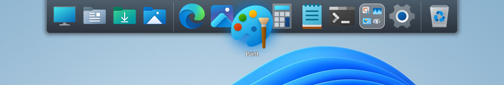
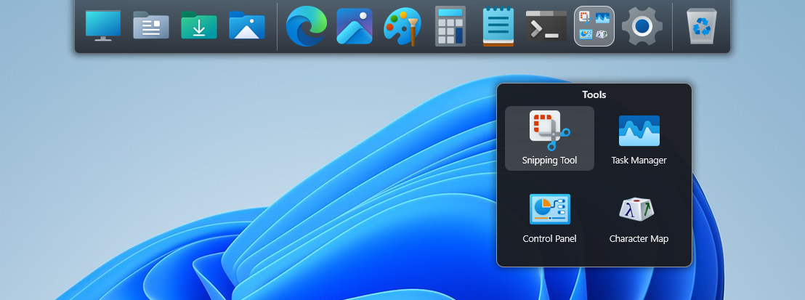
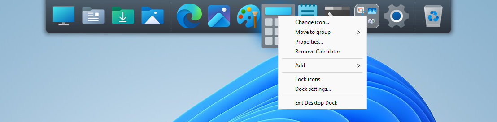
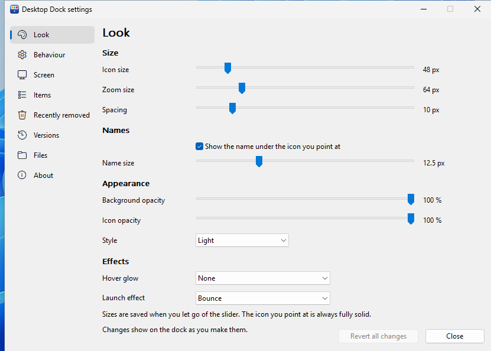
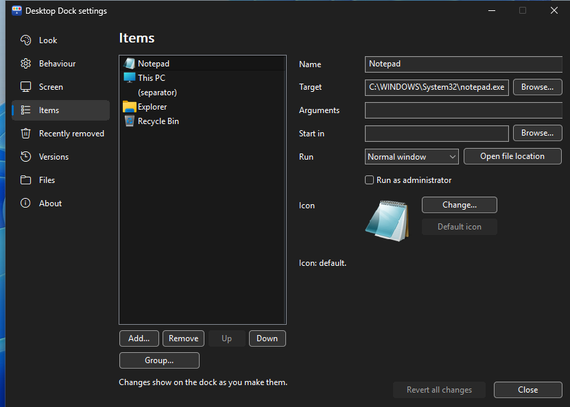
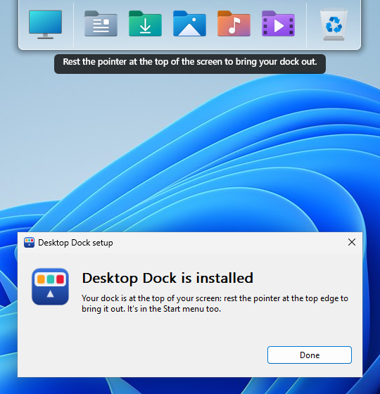

# Desktop Dock

A lightweight dock for Windows 11. It stays hidden at the top of your screen and slides down when you move your mouse there, keeping your programs, folders and files one click away. Inspired by the original RocketDock and its creators at Punk Labs ♥



**[Download the latest release](https://github.com/MichaelPawluk/DesktopDock/releases/latest)** · Windows 11, 64-bit · free and open source (MIT) · use at your own risk

## Features

- **Out of the way until you need it:** move your mouse to the top of the screen and the dock slides down. Icons grow as you hover over them and show their names. It stays hidden while you're in a fullscreen game or video.
- **Drag and drop:** add files, folders, programs and links by dragging them from File Explorer, the Start menu or a browser. Drop a file on a program's icon to open it with that program, or on the Recycle Bin to delete it.
- **Groups:** put related items together under one icon that opens a pop-up.
- **Windows items:** add This PC, Downloads, Control Panel, Settings, Show desktop and more.
- **Hard to break:** every change can be undone, recently removed items can be put back, and your dock is backed up automatically.
- **Finds moved programs:** when an update moves a program, for example Photoshop 2026 being replaced by Photoshop 2027, the dock finds the new version on its own.
- **Easy switch from RocketDock:** import your existing RocketDock setup, icons and all.
- **Light or dark:** matches your Windows theme, with an optional hover glow in your accent colour.
- **Lightweight:** uses about 9 MB of memory, never goes online and collects no data.

<p align="center">
  
  
</p>
<p align="center">
  
  
</p>

## Install

**Requirements:** Windows 11, 64-bit (x64). No other software or administrator rights are needed.

1. Download `DesktopDock-<version>.zip` from [Releases](https://github.com/MichaelPawluk/DesktopDock/releases/latest) and unzip it.
2. Run `desktop-dock.exe` and click **Install**.

The program isn't digitally signed (a code-signing certificate costs money every year), so Windows shows a warning the first time you run it. If you see "Unknown Publisher", click **Run**. If you see "Windows protected your PC", click **More info**, then **Run anyway**.

Desktop Dock installs for your user account only, in `%LOCALAPPDATA%\Programs\Desktop Dock` (or another folder you choose with **Change…**). It adds a Start menu shortcut and an entry in Settings > Apps > Installed apps, and starts with Windows unless you untick that option.



- **Updating:** run the newer `desktop-dock.exe` and click **Update**. Your icons and settings are kept.
- **If you closed the dock:** start Desktop Dock from the Start menu. Starting it while it's already running opens its settings.
- **Uninstalling:** Settings > Apps > Installed apps > Desktop Dock > Uninstall. Your dock is kept in case you reinstall, unless you tick *Also remove my dock*.

## How to use it

- **Open something:** click its icon.
- **Add something:** drag it onto the dock, or right-click the dock and choose Add (File, Folder, Separator, Recycle Bin, or a Windows item).
- **Rearrange:** drag icons to new spots. To remove one, drag it off the dock. An Undo button appears for a few seconds, and right-click > Put back restores anything removed recently.
- **Groups:** right-click an icon > Move to group > New group, or drag an icon onto an existing group. Click a group to open it, then drag items in, out or around inside it.
- **Lock icons:** right-click > Lock icons prevents accidental dragging. Hold Ctrl to move an icon anyway.
- **Keyboard shortcut:** set one in Dock settings > Screen (for example Ctrl+Shift+D) to show the dock. Press it again, or Esc, to hide it.
- **Change an icon:** right-click > Change icon… and pick your own image, one of the program's icons, or a Windows icon.
- **Everything else:** right-click > Dock settings…

Changes in Dock settings show on the dock straight away, and **Revert all changes** puts everything back the way it was when you opened the window. The settings are split into Look, Behaviour, Screen, Items, Recently removed, Versions, Files and About.

## Switching from RocketDock

Go to Dock settings > Files > **Import from RocketDock**. You can import straight from RocketDock on this PC, or from a `.reg` export of its settings (`reg export HKCU\Software\RocketDock rocketdock.reg`). Your icons, their order, and RocketDock's sizes and timings are brought over. Your current dock is saved in Versions first, so you can always go back.

## Where your files are

Everything is kept in the install folder:

| | |
|---|---|
| `desktop-dock.exe` | the program |
| `dock.toml` | your dock's items and settings, in plain text ([format](docs/config-format.md)); changes you make by hand are picked up when you save the file |
| `backups\` | automatic backups and snapshots |
| `removed.toml` | items you removed recently |
| `shortcuts\` | copies of shortcuts you dropped on the dock, so they keep working if the original is deleted |
| `cache\icons\` | cached icons (safe to delete) |
| `logs\` | a log of what the dock did (the most recent 512 KB) |

## Known issues

- If you press Esc at the exact moment you drop an icon, while another program's message box is in front and catches the keypress, the icon may be moved instead of the drag being cancelled. Undo puts it back.
- If `dock.toml` is edited by hand while you're dragging an icon, the move is applied to the edited file instead of the drag being cancelled. Your edit is kept, and Undo is available.
- Windows on ARM hasn't been tested.

## Building from source

You'll need Rust (stable) and the Visual Studio C++ build tools (for the Windows SDK's resource compiler).

```
cargo build --release      # target\release\desktop-dock.exe
cargo test
.\tools\package.ps1        # the release: dist\DesktopDock-<version>.zip
```

Builds are reproducible: the same source, built with the same Rust and Visual Studio versions (listed in each release's notes), produces a byte-identical `desktop-dock.exe`. You can check a release against its source using the SHA-256 published with it.

## Licence

MIT. See [LICENSE](LICENSE). Desktop Dock is provided as is, without warranty of any kind, so use it at your own risk. It isn't affiliated with RocketDock or Punk Labs. The open-source libraries it uses, and their licences, are listed in `THIRD-PARTY-NOTICES.txt` in each release.
